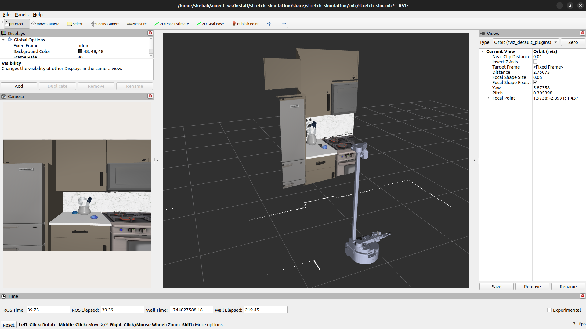

# Stretch Simulation in ROS2

Use this package to use ROS2 with Stretch in Mujoco.

## System Requirements

It is recommended to run this package on an Ubuntu 22.04 workstation with an Nvidia graphics card or a WSL2 environment with GPU acceleration. 

Minimum: 16GB of RAM. Recommended: 32GB of RAM.

This package is not supported on Metal (MacOS) at this time due to the lack of GPU acceleration and OpenGL 1.5+ support in Docker, and slow performance in UTM with a virtual machine.

## Nav2

First go through the [Getting Started](#getting-started) guide to set up your environment.

### Mapping

This section is similar to https://docs.hello-robot.com/0.3/ros2/navigation_stack/#mapping, but uses the Stretch simulation environment.

To map the simulated environment, run the following:

```shell
# Terminal 1: Slam Toolbox
ros2 launch stretch_nav2 online_async_launch.py use_sim_time:=true 
# Optional: Navigation bringup:
ros2 launch stretch_nav2 navigation.launch.py use_slam:=true use_sim_time:=true use_rviz:=true teleop_type:=none

# Terminal 2: Stretch Mujoco Driver
export MUJOCO_GL=egl # On Ubuntu, tell Mujoco to use the GPU
ros2 launch stretch_simulation stretch_mujoco_driver.launch.py use_mujoco_viewer:=true mode:=navigation

# Terminal 3: Keyboard Teleop
ros2 service call /switch_to_navigation_mode std_srvs/srv/Trigger
ros2 run teleop_twist_keyboard teleop_twist_keyboard --ros-args --remap cmd_vel:=/stretch/cmd_vel
```

To save your map, run:

```sh
mkdir ${HELLO_FLEET_PATH}/maps
ros2 run nav2_map_server map_saver_cli -f ${HELLO_FLEET_PATH}/maps/<map_name>
```

### Navigation

To run navigation on a previously generated map, run:

```sh
# Terminal 1: Stretch Mujoco Driver
ros2 launch stretch_simulation stretch_mujoco_driver.launch.py use_mujoco_viewer:=true use_rviz:=false mode:=navigation

# Terminal 2: Navigation
ros2 service call /switch_to_navigation_mode std_srvs/srv/Trigger

ros2 launch stretch_nav2 navigation.launch.py map:=${HELLO_FLEET_PATH}/maps/<map_name>.yaml use_sim_time:=true use_rviz:=true teleop_type:=none
```

You may want to dynamically reduce the cost_map inflation radius for most Robocasa environments:

```shell
ros2 param get /global_costmap/global_costmap inflation_layer.inflation_radius
ros2 param get /local_costmap/local_costmap  inflation_layer.inflation_radius

ros2 param set /global_costmap/global_costmap inflation_layer.inflation_radius 0.20
ros2 param set /local_costmap/local_costmap  inflation_layer.inflation_radius 0.20
```

#### Pre-mapped scene

There are [maps](./maps/) included in this package that you can use with navigation out of the box.

Launch the pre-mapped environment using the following commands:

```shell
# Terminal 1
ros2 launch stretch_simulation stretch_mujoco_driver.launch.py use_mujoco_viewer:=true mode:=navigation robocasa_layout:='G-shaped' robocasa_style:=Modern_1

# Terminal 2
ros2 launch stretch_nav2 navigation.launch.py map:=~/ament_ws/src/stretch_ros2/stretch_simulation/maps/gshaped_modern1_robocasa.yaml use_sim_time:=true use_rviz:=true teleop_type:=none

# Terminal 3
ros2 service call /stow_the_robot std_srvs/srv/Trigger
ros2 param set /global_costmap/global_costmap inflation_layer.inflation_radius 0.20
ros2 param set /local_costmap/local_costmap  inflation_layer.inflation_radius 0.20
```

### Web Teleop

You can use Stretch Web Teleop with the Stretch Simulation environment! 


Before you start, install the dependencies for Stretch Web Teleop by following these [instructions](#setting-up-stretch-web-teleop).


Use the following commands to start Stretch Mujoco with Web Teleop:
```shell
parallel_terminal="gnome-terminal --tab -- /bin/bash -c " # or "xterm -e"

# Terminal 1
$parallel_terminal "MUJOCO_GL=egl ros2 launch stretch_simulation stretch_mujoco_driver.launch.py use_mujoco_viewer:=false mode:=position robocasa_layout:='G-shaped' robocasa_style:=Modern_1 use_rviz:=false use_cameras:=true map:=~/ament_ws/src/stretch_ros2/stretch_simulation/maps/gshaped_modern1_robocasa.yaml" &

# Terminal 2
$parallel_terminal "ros2 launch stretch_simulation stretch_simulation_web_interface.launch.py" &

# Terminal 3
$parallel_terminal "cd ~/ament_ws/src/stretch_web_teleop; npm run localstorage" &

# Terminal 4
$parallel_terminal "cd ~/ament_ws/src/stretch_web_teleop; sudo node ./server.js" &

# Terminal 4
$parallel_terminal "cd ~/ament_ws/src/stretch_web_teleop; node start_robot_browser.js" &
```

## Cameras and PointClouds

Please use the `use_cameras:=true` argument to enable cameras and pointclouds. e.g. `ros2 launch stretch_simulation stretch_mujoco_driver.launch.py use_mujoco_viewer:=true mode:=navigation use_cameras:=true`

There are five camera topics being published:
- RGB and Depth for the D405 camera in the gripper.
- RGB and Depth or the D435i camera in the head.
- RGB for the wide-lens camera in the head.

The RGB and Depth frames are used to create two PointCloud2 topics as well.




## Stretch Drivers

Simulation Drivers interface with the simulator to read and write data.

Simulation Drivers mimic the StretchDriver in `stretch_core`, which talks to the real robot. 

You could display all the launch options available to the Stretch Mujoco Driver using: `ros2 launch stretch_simulation stretch_mujoco_driver.launch.py --show-args`:

```
    'broadcast_odom_tf':
        Whether to broadcast the odom TF. Valid choices are: ['True', 'False']
        (default: 'True')

    'fail_out_of_range_goal':
        Whether the motion action servers fail on out-of-range commands. Valid choices are: ['True', 'False']
        (default: 'False')

    'mode':
        The mode in which the ROS driver commands the robot. Valid choices are: ['position', 'navigation', 'trajectory', 'gamepad']
        (default: 'position')

    'use_rviz':
        One of: ['true', 'false']
        (default: 'true')

    'use_mujoco_viewer':
        One of: ['true', 'false']
        (default: 'true')

    'use_cameras':
        One of: ['true', 'false']
        (default: 'false')

    'use_robocasa':
        One of: ['true', 'false']
        (default: 'true')

    'robocasa_task':
        no description given
        (default: 'PnPCounterToCab')

    'robocasa_layout':
        One of: ['Random', 'One wall', 'One wall w/ island', 'L-shaped', 'L-shaped w/ island', 'Galley', 'U-shaped', 'U-shaped w/ island', 'G-shaped', 'G-shaped (large)', 'Wraparound']
        (default: 'Random')

    'robocasa_style':
        One of: ['Random', 'Industrial', 'Scandanavian', 'Coastal', 'Modern_1', 'Modern_2', 'Traditional_1', 'Traditional_2', 'Farmhouse', 'Rustic', 'Mediterranean', 'Transitional_1', 'Transitional_2']
        (default: 'Random')

```

You can also set the node's argument`arguments=["--ros-args", "--log-level", "debug"]` in the launch file to display Sim-to-Real time and other useful debug information.

## Getting Started

You should go through all the sections in Getting Started to run this package correctly.

> NOTE: If you are running on a Stretch robot, you may not need to run Stretch Simulation, unless you are trying to test out the simulation environment.

Estimated install time: `~1-2hrs`.

### Docker Install (Recommended)

If you are on Linux or Windows, you can use the [Docker setup](README_DOCKER.md) to get started using Docker with hardware acceleration. This is not supported on MacOS due to the lack of OpenGL 1.5+ support in Docker.

### Native Install

If you would like to install Stretch Simulation directly on your host machine, please follow the [README_SETUP](README_SETUP.md) instructions.
